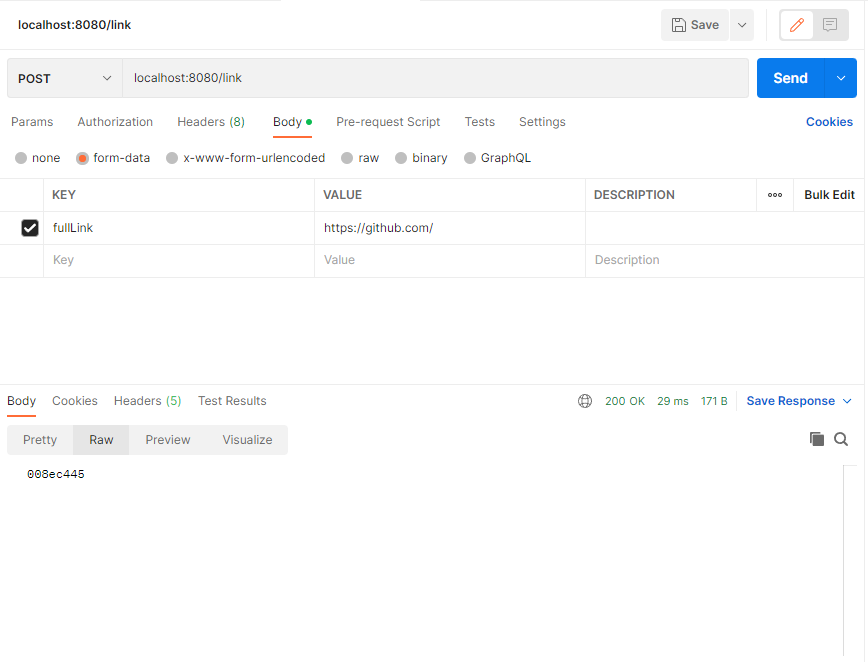

# LinkShortener
## Running the application:
1. Clone the project to a local repository
2. Start the project by running the command: mvn spring-boot:run
3. Go to localhost:8080/ after the project has started to see the application
4. Copy any full link (including http://) into the form to generate a short version of the link
5. Copy the resulting link

## REST APIs
- /link  
Method type: POST  
consumes: form-data, x-www-form-urlencoded  
produces a 8 character String that should be appended to the end of "localhost:8080/link/"  

- /link/{shortLink}  
Method type: GET  
Returns a redirect to the full link if a full link is associated to the short link
